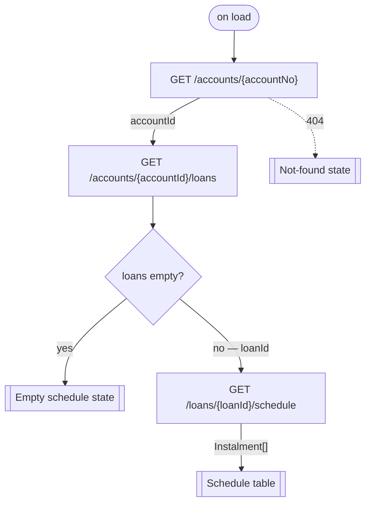

# Figma Starter — a Spec Kit extension

A [GitHub Spec Kit](https://github.com/github/spec-kit) extension that turns a **Figma section's screens** into
Figma-derived specs — per-screen `spec.md` files, app-level `user-stories.md`, and a `build-order.md` — and turns
an **OpenAPI/Swagger document** into an entity model plus per-page UI ↔ API bindings, then hands off to core
`/speckit.specify`.

## Quick start

```bash
specify init .                              # initialize in the current folder
specify init folder_name --integration [choose your agent]   # or create a new folder
specify extension add figma-starter \
  --from https://github.com/OmneWave/spec-kit-figma-starter/archive/refs/tags/v1.1.0.zip
```

It adds two commands — one for the design side, one for the data side:

```
/speckit.figma-starter.import       <figma-section-url>   [-o <module-name>]
/speckit.figma-starter.import-api <swagger-url-or-file> [-m <module-name>] [--out <folder>] [--page <slug>]
```

| Command | Answers |
|---------|---------|
| `import` | **What does the user see?** — screens, flows, layout, user stories |
| `import-api` | **What data sits behind it?** — entities, and which endpoint backs which element |

Run `import` first — `import-api` binds endpoints to the screens it produced, so it needs them to exist.

Agent-agnostic: the commands and pipelines are plain Markdown, so Spec Kit registers them for whichever agent you
picked at `specify init` (Claude, Cursor, Copilot, Gemini, Windsurf, …). Icon/embedded-image export and the API
document fetch run through bundled **standard-library `python3` scripts** — no `pip install`, no `uv`, no extra CLI.

> **What makes this different from other Figma extensions:** it is *screen/image-driven*. It pulls the actual
> rendered frames, traces prototype navigation into a flow map, and emits one spec per screen in build order —
> rather than only grounding generation in design tokens/context. The API side follows the same principle: it
> binds endpoints by reading the **rendered screens**, since a table's column headers and a form's field labels
> are the strongest evidence of which entity fields a page actually uses.

## Where it fits

Both commands sit **between `/speckit.constitution` and `/speckit.specify`** — turning your design and your API
into the specs that `/speckit.specify` then consumes:

```text
specify init                    create a Spec Kit project
        │
/speckit.constitution           establish project principles
        │
/speckit.figma-starter.import      👈 THIS EXTENSION — Figma section → per-screen specs
        │
/speckit.figma-starter.import-api  👈 THIS EXTENSION — Swagger → entities + per-page bindings
        │
/speckit.specify                synthesize both into a feature spec
        │
/speckit.plan  →  /speckit.tasks  →  /speckit.implement
```

`import-api` is optional, but when you do run it, it runs **second**: it binds endpoints to the page folders
`import` created, and stops if they are not there.

**You don't have to run `/speckit.constitution` first.** Neither command needs one, so you can install the
extension and run `import` right away. If no constitution exists yet (`.specify/memory/constitution.md`), the
command asks whether you'd like to set one up with `/speckit.constitution` **before** it hands off to
`/speckit.specify` — so you end up with a constitution either way:

```text
/speckit.figma-starter.import     run right after install — Figma section → per-screen specs
        │
   (no constitution yet?)  →    "Set one up with /speckit.constitution first?"  →  /speckit.constitution
        │
/speckit.specify  →  /speckit.plan  →  /speckit.tasks  →  /speckit.implement
```

## Getting started

### Step 1 — Install Spec Kit and initialize a project

If you don't already have a Spec Kit project, install the CLI and run `specify init`. Pick your agent with
`--integration` (e.g. `claude`, `cursor`, `copilot`, `gemini`, `windsurf`). Check the
[Spec Kit repo](https://github.com/github/spec-kit) for the latest release tag.

```bash
# install the Spec Kit CLI (replace the tag with the latest release)
uv tool install specify-cli --from git+https://github.com/github/spec-kit.git@v0.12.14

# create a project, then cd into it
specify init my-app --integration claude
cd my-app
```

### Step 2 — Add this extension

From your Spec Kit project root, install directly from a release archive:

```bash
specify extension add figma-starter \
  --from https://github.com/OmneWave/spec-kit-figma-starter/archive/refs/tags/v1.1.0.zip
```

Or, for local development against a checkout of this repo:

```bash
specify extension add --dev /path/to/figma-starter
```

Verify it registered:

```bash
specify extension list   # should show "Figma Starter (v1.1.0)"
```

> **Note on the community catalog:** the Spec Kit community catalog is *discovery-only*
> (`install_allowed: false`) — being listed there makes the extension searchable, but users still install with
> `--from <url>` above (or by copying the entry into their own `catalog.json`).

### Step 3 — Set your tokens

Export them, or put them in a `.env` file at the project root. Without a Figma token the import pipeline falls
back to the Figma MCP server. A Swagger token is only needed if your API document is behind auth.

```bash
export FIGMA_TOKEN=figd_...           # or FIGMA_ACCESS_TOKEN
export SWAGGER_TOKEN=...              # or API_TOKEN — only for a protected API document
# or: echo 'FIGMA_TOKEN=figd_...' >> .env
```

Instead of `SWAGGER_TOKEN` you can pass any header inline, repeatably:
`--header "Authorization: Bearer <token>"`.

You also need `python3` >= 3.8 on your PATH — used for the REST asset pull and the API document fetch (standard
library only, no `pip install`). A **YAML** OpenAPI document additionally needs `pyyaml`; JSON needs nothing.

### Step 4 — Run the workflow

The recommended order establishes your project principles first, generates the Figma-derived specs with this
extension, then hands off to core Spec Kit:

```text
/speckit.constitution                                               # 1. project principles
/speckit.figma-starter.import      <figma-section-url> [-o <name>]  # 2. Figma → specs
/speckit.figma-starter.import-api  <swagger-url> -m <name>          # 3. Swagger → entities + bindings
/speckit.specify                                                    # 4. point it at figma-starter/<module>/ + api-specs/
/speckit.plan                                                       # 5. technical plan
/speckit.tasks                                                      # 6. task list
/speckit.implement                                                  # 7. build it
```

**Use the same module name in both commands** — `import -o <name>` writes that module folder, and
`import-api -m <name>` reads it. The flags differ because their jobs do: `-o` names where `import` puts its
output, while `-m` names the module `import-api` binds against. With the wrong name it finds no screens and
stops, suggesting the name it thinks you meant. If `figma-starter/` holds more than one module and you omit
`-m`, it stops and lists them rather than guessing.

**With several modules, give each one an output folder:** `--out <folder>` renames `api-specs/`, and
`entities.md` and `api-catalog.md` sit at the top of it describing the module that was run, so without it the
second module's run overwrites the first's.

```bash
/speckit.figma-starter.import-api <swagger-url> -m storefront --out api-specs-storefront
/speckit.figma-starter.import-api <swagger-url> -m checkout   --out api-specs-checkout
```

The extra output folders sit beside the modules without ever being counted as one — a folder holding an
`.api-index.json` is this pipeline's own — so `-m` stays optional on a single-module project no matter how
many times you re-run. `--out` takes one folder name, not a path, and refuses to name a design module.

Prefer to start straight away? `import` works standalone:

```text
/speckit.figma-starter.import <figma-section-url> [-o <name>]  # run right after install
# → if no constitution exists, the command asks whether to set one up with
#   /speckit.constitution before you continue to /speckit.specify
/speckit.specify  →  /speckit.plan  →  /speckit.tasks  →  /speckit.implement
```

Each command runs four steps in order and then stops, handing the result to `/speckit.specify`:

**`import`** — Figma section → per-screen specs

| Step | What it does |
|------|--------------|
| pull-screens | Download section frames as PNGs + prototype taps → `screens.json` |
| trace-flows  | Build a flow map (pages, dialogs, journeys) |
| read-screens | Layout notes per page / dialog / step |
| write-spec   | `user-stories.md`, `build-order.md`, one `spec.md` per screen |

Design **tokens** and **typography** come from the local Figma MCP (`get_variable_defs`, `get_design_context`);
**icons** and **embedded images** come from the bundled REST helper in the background.

**`import-api`** — OpenAPI/Swagger → entity model + UI ↔ API bindings

| Step | What it does |
|------|--------------|
| pull-api        | Fetch the document and flatten it into `api-specs/.api-index.json` |
| derive-entities | `api-specs/entities.md` — the entity model the UI must carry |
| bind-ui         | Match endpoints to UI elements, reading each page's spec **and its screenshots**, and chart the chains where one call is not enough |
| write-api-spec  | One `api-specs/<NN>-<slug>/api-bindings.md` per page, then `api-specs/api-catalog.md` summarising them |

Its output lands in `figma-starter/api-specs/`, a sibling of the module folder laid out the same way — one
folder per page, matching names. The module folder itself is read-only to this command. `api-specs` is the
default name; `--out <folder>` gives a run its own output folder, which is what a multi-module project needs.

OpenAPI 3.x and Swagger 2.0 both normalize into the same index — `$ref`s resolved, `allOf` chains merged,
pagination envelopes (`Page<T>`) unwrapped to the element type.

### Screens are a prerequisite, and build order is the order

There is no screenless mode. `import-api` binds endpoints to screens, so if `figma-starter/` holds no module —
or the module holds no page folder with a `spec.md` — it stops and tells you to run `import` first. It will not
invent screens to bind against.

Given screens, the pages are worked through in the order **`build-order.md`** lays out: the order the user
journeys run, which is rarely the order the folders are numbered. Binding `Dashboard` after `Login` makes it
obvious where the session and the user id come from; binding it first makes that a mystery to solve twice.

### Bindings are element-level, and gaps are the point

A binding names the element, when it fires, what it sends and where each parameter comes from, what the response
fills, and whether a field actually carries what the screen shows:

| Element | Trigger | Endpoint | Sends | Populates | Value source | Notes |
|---------|---------|----------|-------|-----------|--------------|-------|
| `Specification List / search field` | on type | `GET /specifications` | `q` ← field text | `200` `Specification[]` → table rows | `—` | Debounce expected; not stated in the document |
| `Specification List / Created on range` | on change | `—` | — | — | `—` | Unbound: `GET /specifications` has no date parameters; only client-side filtering is possible today |

A repeating row or card is **one call, then a field map** — the collection call stated once, followed by a table
saying which field of one element fills which part of one row or card. Never one call per row. The same rule
holds when one response fills a table *and* the summary cards above it: bound once, with a note naming what else
it feeds, so nobody builds two round trips out of it.

Every endpoint a page uses also gets **one worked example** under `## Endpoint examples` — the request, the
headers that matter, the body, and a trimmed response — written once at first use however many sections call it.

Where nothing matches, that is recorded rather than papered over — **unbound UI** (an element with no endpoint,
as above) and **unused endpoints** (endpoints the screens never call). On a generated back-office API those two
lists are usually the most useful output of the whole run, and `api-specs/api-catalog.md` gathers both across
every page once the run finishes.

Pass `--page <slug>` to redo one screen's bindings without touching the others — useful after a single `spec.md`
changed. It accepts `01-specification-list`, `specification-list`, or just `1`. A page-scoped run leaves
`api-catalog.md` alone: one screen is not evidence for what the whole module calls.

### When one call is not enough

A binding row says *which* endpoint serves an element. It cannot say **in what order** — and on a generated
API one call is often not enough: the id the call needs is itself the result of an earlier call, a displayed
name has to be looked up from an id, a write has to run create-then-attach-then-submit. That is where
implementations get invented, because the row looks bound and `{loanId}` turns out to come from nowhere.

So each page carries a `## Call sequences` section — the one part of the output that is **not** a table,
because an order, a branch, a parallel leg and a per-row fan-out do not fit in a row. Each chain gets a
flowchart, with the value that moves labelled on every arrow and the branches the document actually declares:



Under it, a step table making the chain checkable — every `Needs` has to resolve to the route, a user input,
or an earlier step's `Yields`, and one that does not is reported as a finding rather than papered over:

| Step | Call | Needs | Yields | Blocking |
|------|------|-------|--------|----------|
| 1 | `GET /accounts/{accountNo}` | `accountNo` ← route | `Account.id` | blocks step 2 |
| 2 | `GET /accounts/{accountId}/loans` | `accountId` ← step 1.`Account.id` | `Loan.id` where `status = ACTIVE` | blocks step 3 |
| 3 | `GET /loans/{loanId}/schedule` | `loanId` ← step 2; `page`, `size` ← pagination state | `Instalment[]` → rows | — |

The payloads are not repeated here — each step links to that endpoint's example, so the chain shows only the
value that carries from one call to the next.

Chains are charted the way they should be built, not the first way that works: server-side filters instead of
fetching and discarding, one reference list fetched once and joined instead of one call per row, independent
legs marked `parallel`. Where the document cannot complete a chain it stops at a `MISSING` node with
what it would need, instead of inventing an endpoint. `api-catalog.md` lists every chain in the module in one
table.

### What the API carries vs. what the screen works out

A screen states more than an API stores, and that gap is where implementations get invented. So every element
that shows a value is marked `direct`, `derived`, or `static` — and formatting a field is not deriving a value:

> `Payments completed 120/120` is **direct** — `paidInstalments` and `totalInstalments`, printed together.
> `Account Health: Excellent` on the same card is **derived** — nothing in the document holds `Excellent`, and
> nothing says where `Excellent` stops and `Good` begins.

Each derived value gets its own entry in that page's `## Derived values` — where it shows, the **minimal**
attribute set the rule reads with the call behind each, what has to change for the value to move, where the rule
came from, a confidence of `certain` / `fairly certain` / `uncertain`, and the logic as pseudocode:

```text
### Account Health

- Shown in:    Account Detail / Card: Account health / verdict
- Inputs:      Account.paidInstalments, .totalInstalments, .overdueAmount ← GET /accounts/{id}
- Changes when: a payment is posted, or an instalment falls overdue
- Source:      card legend
- Confidence:  uncertain

    if account.overdueAmount > 0: return "At risk"
    ratio = account.paidInstalments / account.totalInstalments
    if ratio >= 0.95: return "Excellent"
    if ratio >= 0.80: return "Good"
    return "Fair"
```

**Every one of these is BFF work** — a derivation belongs in the backend-for-frontend layer, not the component,
and the spec says so. It does *not* invent a `GET /bff/…` route to put it behind: naming an endpoint the
document never declared is exactly the failure the rest of the pipeline exists to prevent.

Only values that move with the record qualify — a label, a legend, or a total the pagination envelope already
carries is not a derivation. Where the document cannot support a value at all, the entry says
`not derivable` and what it would need, rather than naming a field that does not exist. `api-catalog.md` rolls
these up across the module: the value, the screens showing it, and the calls behind it.

## Output

The two commands write to **two sibling trees with the same shape**: `import` fills the module folder, and
`import-api` fills `api-specs/`, one folder per page under each. A screen and the data contract behind it are
one folder name apart, and neither command overwrites the other's work. `api-specs` below is the default output
name — with `--out` it is whatever you called it, and a multi-module project has one per module.

```
figma-starter/                     ← under the project root
  <module>/                          the design source — written by import
    screens.json
    resources-manifest.json
    user-stories.md
    build-order.md
    design-tokens/tokens.json        module-level (shared)
    typography/typography.json       module-level (shared)
    01-<slug>/
      spec.md
      figma-resources/
        screens/01-<slug>.png
        icons/*.svg
        embedded/*.png
    ...
  api-specs/                       ← the data source — written by import-api
    .api-index.json              ← the normalized document — every later step reads this
    entities.md                  ← the entity model the UI must carry
    api-catalog.md               ← written last — every endpoint and which screens call it
    01-<slug>/                   ← mirrors the page folder of the same name
      api-bindings.md            ← entities, bindings, sequences, derived values, examples
    ...
```

`import-api` reads the module folder — page specs, screenshots, user stories — and writes only under
`api-specs/`, so a re-run can never disturb a reviewed screen spec.

`api-catalog.md` is written **last**, once every page's bindings exist, and is a roll-up of them rather than a
second rendering of the document: every endpoint with the screens that call it, the endpoints nothing calls, the
UI nothing serves, the chains that have to be orchestrated, the values that
have to be computed, and which screens touch each entity. Parameters, payloads, field lists, pseudocode and
flowcharts stay out of it — `.api-index.json` holds those and the page files interpret them, so there is
nothing here to drift. It is the one file that answers *how much of this API does the design actually use*.

From there, continue with core Spec Kit: `/speckit.specify` → `/speckit.plan` → `/speckit.tasks` →
`/speckit.implement`. Point `/speckit.specify` at both `figma-starter/<module>/` and `figma-starter/api-specs/`
for the whole module, or at one `<NN>-<slug>/spec.md` with its `api-specs/<NN>-<slug>/api-bindings.md` to build
a single screen.

## Layout of this repo

```
figma-starter/
├── extension.yml                 # Spec Kit manifest
├── commands/
│   ├── speckit.figma-starter.import.md
│   └── speckit.figma-starter.import-api.md
├── scripts/
│   ├── figma_pull.py             # self-contained stdlib REST helper (screens + resources)
│   └── swagger_pull.py           # self-contained stdlib fetch + normalize (OpenAPI 3.x / Swagger 2.0)
├── figma-images-to-spec/         # the design-side pipeline (installed alongside the command)
│   ├── SKILL.md  USER.md
│   ├── pull-screens/  trace-flows/  read-screens/  pull-resources/
│   └── write-spec/ (+ FORMAT-*.md)
├── swagger-to-spec/              # the data-side pipeline
│   ├── SKILL.md  USER.md
│   ├── pull-api/  derive-entities/  bind-ui/
│   └── write-api-spec/ (+ FORMAT-*.md)
├── README.md  LICENSE  CHANGELOG.md
├── .env.example  .gitignore  .extensionignore
```

Each pipeline is a folder of Markdown skills: an orchestrator `SKILL.md`, one `<step>/SKILL.md` per step, and
`FORMAT-*.md` templates showing the exact shape of each output file. The agent reads a step's instructions only
when it runs that step.

## License

MIT — see [LICENSE](LICENSE).
