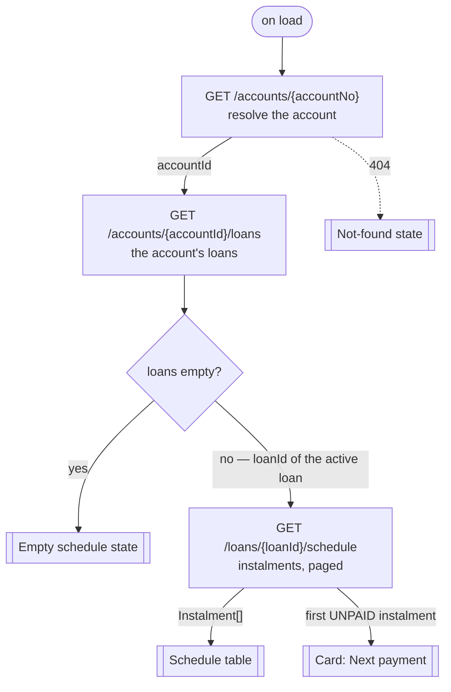
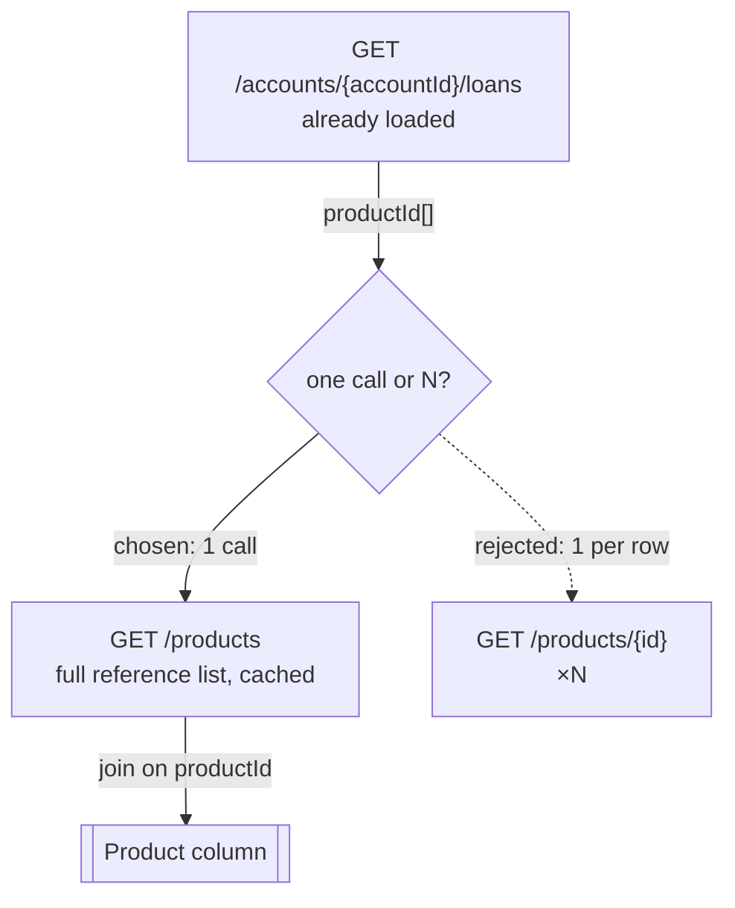
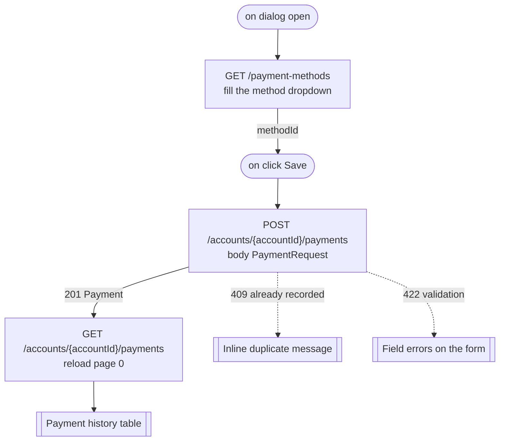
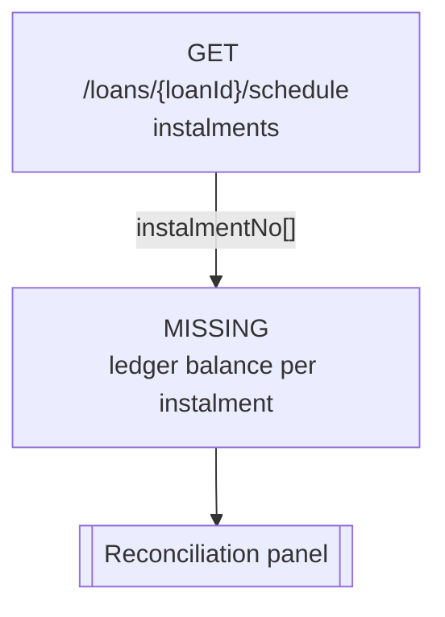

# Call sequences format (`## Call sequences` in `api-specs/<NN>-<slug>/api-bindings.md`)

**The one section of the page file that is not a table.** Everywhere else, a row is enough: one element, one endpoint, one trigger. A chain is not — it has an order, branches the document declares, legs that run in parallel, and loops that fan out per row. Flattening that into a table loses exactly the part a developer needs.

So each chain is written as a **flowchart and a step table**, under `### <Sequence name>`.

Write one for every element whose data takes **more than one call** to obtain. A single call whose parameters the screen already has is not a sequence — its section row already says everything. See [bind-ui step 5](../bind-ui/SKILL.md#5--chart-the-call-sequences) for the triggers that make a chain worth charting.

## Shape of one sequence

| Part | Content |
|------|---------|
| `### <Sequence name>` | Named after what it fills on screen — `Populate the branch dropdown`, `Load the repayment schedule`. The name section rows link to |
| Intro sentence | What the screen needs, and why one call cannot give it |
| `**Serves:**` | The element location(s), in the same form as the section tables |
| Flowchart | A fenced ` ```mermaid ` `flowchart TD` — every call in order, the branches, the loops, ending at the UI target |
| Step table | Step, Call, Needs, Yields, Blocking — one row per call |
| `**Payload shapes:**` | Links to each step's entry under `## Endpoint examples`, where the request and response live |

### The flowchart

Mermaid, because it renders in GitHub, most IDEs, and every Spec Kit agent's Markdown view, and stays readable as plain text where it does not.

Rules that keep the charts comparable to each other:

- `flowchart TD`, top to bottom, one node per call, labelled `METHOD /path` and, after a `<br/>`, what the call is for. **No backticks inside node or edge labels** — Mermaid reads a backtick as the start of a markdown string and the chart fails to render. Quote the label instead: `A["GET /loans/{loanId}/schedule<br/>instalments, paged"]`.
- **Label every edge with the value that moves along it** — `loanId`, `productId[]`, `page=2`. An unlabelled edge is the whole thing the chart exists to show, left out.
- Show the **branches the document declares**, not invented ones: a `404` to an empty state, a `409` to a duplicate-name message, an empty collection to a zero state. Use a `{ }` decision node.
- Show a **fan-out** as a loop back with the count on the edge (`for each row`), so the repetition is visible in the chart.
- Start at the trigger (`([on load])`, `([on click Search])`) and end at the UI target (`[[Table rows]]`, `[[Branch dropdown]]`).
- Parallel legs branch from one node and rejoin — do not stack them vertically, which reads as an order that is not there.
- A **missing** step — a call the design needs and the document does not have — is a node marked `MISSING` with what it would need. Never draw an endpoint that is not in `.api-index.json`.

### The step table

| Column | Content |
|--------|---------|
| `Step` | `1`, `2`, `2a`/`2b` for parallel legs, `3 (×N)` for a fan-out |
| `Call` | `` `METHOD /path` ``, or `—` for a client-side step that carries a value forward, or `MISSING` |
| `Needs` | Each input with where it comes from — `route`, `user input`, or `step <n>.<field>`. This is the column that makes the chain checkable |
| `Yields` | Only the fields the later steps or the screen consume — not the whole response |
| `Blocking` | `blocks step <n>`, `parallel with step <n>`, or `—` for the last step |

Every `Needs` must resolve to the route, a user input, or an earlier step's `Yields`. One that does not means the screen cannot be built as designed — say so in the row, rather than leaving a reader to notice.

### Payload shapes live elsewhere

**Do not repeat request and response bodies here.** Every endpoint a page uses already has one worked example under [`## Endpoint examples`](FORMAT-page-bindings.md#endpoint-examples), written once at first use. A three-step chain that restated all three would be the same JSON a second time, and the two copies drift.

What a sequence adds is the part an example cannot show: **the value that carries from one step to the next**. The `Needs` and `Yields` columns hold it, and the edge labels make it visible at a glance. Close with a `**Payload shapes:**` line linking each step's endpoint to its example.

Where the chain has a branch the document declares — a `404` to a not-found state, an empty collection to a zero state, a `409` to a duplicate message — say what it means for the screen in a line under the table. The status codes themselves are in the flowchart; what the user sees is not.

## Example

Note the fence: the sequences below are the literal contents of the section, nested fences included.

````markdown
## Call sequences

### Load the repayment schedule

The schedule table is keyed by loan, and the loan id is not on the route — the screen arrives with an
account number only. One call cannot fill this table.

**Serves:** `Account Detail / schedule table`, `Account Detail / Card: Next payment / due date`



| Step | Call | Needs | Yields | Blocking |
|------|------|-------|--------|----------|
| 1 | `GET /accounts/{accountNo}` | `accountNo` ← route | `Account.id`, `Account.status` | blocks step 2 |
| 2 | `GET /accounts/{accountId}/loans` | `accountId` ← step 1.`Account.id` | `Loan.id`, `Loan.status` | blocks step 3 |
| 3 | `GET /loans/{loanId}/schedule` | `loanId` ← step 2, the `Loan` with `status = ACTIVE`; `page`, `size` ← pagination state | `Instalment[]` → rows; first `status = UNPAID` → Next payment card | — |

The first instalment with `status = UNPAID` is the one the Next payment card shows.

Branches: a `404` on step 1 is the not-found state; an empty array on step 2 leaves the table empty —
`GET /loans/{loanId}/schedule` is never called, since there is no loan to key it by.

**Payload shapes:** [`GET /accounts/{accountNo}`](#endpoint-examples),
[`GET /accounts/{accountId}/loans`](#endpoint-examples),
[`GET /loans/{loanId}/schedule`](#endpoint-examples).

### Resolve product names for the loan rows

The loan rows carry `productId`; the column header reads `Product`. Nothing on `Loan` holds the name.

**Serves:** `Account Detail / loan table / Product column`



| Step | Call | Needs | Yields | Blocking |
|------|------|-------|--------|----------|
| 1 | `GET /accounts/{accountId}/loans` | `accountId` ← Load the repayment schedule, step 1 | `Loan.productId` per row | blocks step 2 |
| 2 | `GET /products` | — | `Product.id`, `Product.name` → joined on `productId` | — |

One `GET /products` for the whole table, joined client-side on `productId` — rejected the per-row
`GET /products/{id}`, which is one call per row for a reference list that barely changes.

**Payload shapes:** [`GET /accounts/{accountId}/loans`](#endpoint-examples),
[`GET /products`](#endpoint-examples).

### Post a payment

`POST /accounts/{accountId}/payments` needs a `methodId` the user picks from a list the screen has to load
first, and the table has to be reloaded afterwards to show the new row.

**Serves:** `Account Detail / Dialog: Record payment / Button: Save`



| Step | Call | Needs | Yields | Blocking |
|------|------|-------|--------|----------|
| 1 | `GET /payment-methods` | — | `PaymentMethod.id`, `.label` → dropdown | blocks step 2 |
| 2 | `POST /accounts/{accountId}/payments` | `accountId` ← route; body `PaymentRequest` ← `amount`, `paidOn` from the form, `methodId` ← step 1 | `201` `Payment.id` | blocks step 3 |
| 3 | `GET /accounts/{accountId}/payments` | `accountId` ← route; `page=0` | `Payment[]` → refreshed rows | — |

Branches: `409` is an inline duplicate message on the dialog, `422` puts the errors on the form fields.
Step 3 runs only after a `201`.

**Payload shapes:** [`GET /payment-methods`](#endpoint-examples),
[`POST /accounts/{accountId}/payments`](#endpoint-examples),
[`GET /accounts/{accountId}/payments`](#endpoint-examples).

### Reconcile against the ledger — incomplete

The Reconciliation panel expects a ledger balance per instalment. The document has no ledger endpoint.

**Serves:** `Account Detail / Reconciliation panel`



| Step | Call | Needs | Yields | Blocking |
|------|------|-------|--------|----------|
| 1 | `GET /loans/{loanId}/schedule` | `loanId` ← Load the repayment schedule, step 2 | `Instalment.instalmentNo` | blocks step 2 |
| 2 | `MISSING` | `instalmentNo` ← step 1 | — | — |

**Missing:** not buildable today. It would need a ledger endpoint keyed by loan and instalment, or a
`ledgerBalance` field on `Instalment`. Until one exists this panel cannot be filled — flagged in
`api-catalog.md` alongside the unbound UI.
````

## Rules

1. **One `###` per sequence**, named after what it fills on screen. The section row that needs it links to it: `sequence: [Load the repayment schedule](#call-sequences)`.
2. **Only chains that serve something on the screen.** No speculative flows, no endpoint tours.
3. **Every node is a documented endpoint**, spelled exactly as `.api-index.json` spells it — or a `MISSING` node with what it would need. Never an invented call, parameter, or `?expand=`.
4. **Every `Needs` resolves** to the route, a user input, or an earlier step's `Yields`. An unresolved one is stated as a finding in the row.
5. **Edges carry the value that moves.** That is the point of the chart.
6. **Sequential means data-dependent.** Two calls that need nothing from each other are `parallel`, and the chart shows them branching, not stacked.
7. **Fan-outs are visible** — in the chart as a loop and in the step table as `(×N)`. Where a collection endpoint can replace them, take it and say what you rejected.
8. **No payloads here.** Requests and responses live once under `## Endpoint examples`; a sequence carries the value moving between steps, and a `**Payload shapes:**` line linking each step to its example.
9. **Do not restate the chain in `Notes`.** The section row names the sequence; this section holds the order.
10. A page with no multi-call chains keeps the heading and one line saying every element is served by a single call — never a missing section.

Backtick every path, method, parameter, entity, and field name in the prose and the step table — but **not inside the flowchart**, where a backtick breaks Mermaid's parser. Inside a chart, the double quotes around the label do that job.
