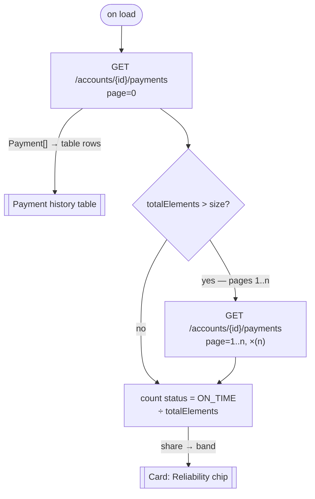

# Page bindings format (`api-specs/<NN>-<slug>/api-bindings.md`)

Markdown tables, one file per page, in the `api-specs/` folder mirroring that page's folder under the module. **Complete data contract for one page** — entities shown, each UI section bound to endpoints, how a list response maps onto the card it fills, which values have to be computed in the BFF, the order the calls run in where one is not enough, a worked example of every endpoint the page uses, and what does not line up.

Pages are written in `build-order.md` order, so a reader working through `api-specs/` follows the same journey the user does.

## One table per UI section

The body of this file is **exactly one table per UI section on the page**, using the same names and the same order as that page's `spec.md` `Layout` block — `Header`, `Cards Section`, `Filters`, `Table`, `Dialog: Row options`, and so on. A reviewer reads the two files side by side, so the sections must line up.

Each section's table is **self-contained**: the element, when it fires, the endpoint, what it sends, what it populates, whether that value is carried or computed, and anything doubtful. Everything a reader needs about that region of the screen is in that one table — no jumping to a separate parameters or responses section.

That means a section's table holds:

- What the section **loads on arrival** and how it **behaves when used** — the `Trigger` column separates them, so do not split these into `Layout` and `Interactions` sections.
- **Parameters**, in the `Sends` column, each with the UI input or entity field that supplies it.
- **Responses**, in the `Populates` column.
- **Whether the value is carried by a field or computed**, in the `Value source` column.
- **Actions** — the buttons that write — as rows like any other, with the trigger and the write endpoint.
- **Unbound elements** — a row with `—` in `Endpoint` and what it would need in `Notes`. There is no separate unbound section.

| Section | Purpose |
|---------|---------|
| `## Entities` | Frames everything below — always first |
| `## <UI section>` | One table per section, in `spec.md` order. A list in it is followed by its field map |
| `## Dialog: <name>` | One per dialog, named exactly as the spec names it |
| `## Call sequences` | Page-level — the ordered chains where one call is not enough. **Not a table**: a flowchart and a step table per chain |
| `## Derived values` | Page-level — one `###` per computed value, with its pseudocode. All BFF work |
| `## Endpoint examples` | Page-level — one `###` per distinct endpoint the page uses, with request, headers, body and response |
| `## Integration` | Cross-page moves that carry data — not a section of the screen, so it keeps its own table |
| `## Unused endpoints` | Page-level leftover — endpoints nothing here calls |

Rules that follow:

- **Only include sections that exist on that page.** No `Dialog:` section on a page with no dialogs.
- **Wizard steps are sections** — `## Step 1: General details`, matching the spec's `Step1:` blocks.
- Fixed regions still get a table, with `—` in `Endpoint`. A `Header` that only shows a title is worth one row saying so.
- Take section names from `spec.md` verbatim. Where the spec only implies a region, name it after what the user sees (`Header`, not `top bar container`).

The `Element` column uses the same location form as the page `spec.md`:

| Location form | Example |
|---------------|---------|
| Page / element | `Specification List / table` |
| Page / dialog / element | `Specification List / Dialog: Advanced Filters / Button: Search` |
| Page / step / element | `Create Specification / Review / Button: Submit` |

## Direct, derived, or static

Every element that shows a value gets a `Value source` of exactly one of:

| Value source | Meaning |
|--------------|---------|
| `direct` | A field on a response carries this value; the screen renders it |
| `derived` | No field carries it — it exists only once you compute over one or more fields. Written `derived → [<value name>](#derived-values)` |
| `static` | The same for every record — a design label, a legend, a unit, a column header |
| `—` | The element shows no value: a button, a nav item, an icon that only opens something |

**Formatting is not derivation.** A date rendered `12 Aug 2026`, an amount with a currency symbol, an enum mapped to a chip colour, two fields shown side by side as `120/120` — all still `direct`. The field is the value; the screen is just dressing it. What makes something `derived` is that the screen states a **fact the API never states**: `120/120` is direct, but calling that `Excellent` is derived, because no field holds `Excellent` and nothing in the response says where the boundary sits.

## Lists, tables, and repeating cards

A repeating structure — table rows, a grid of cards, a stacked panel list — is **one collection endpoint returning an array**, never one call per item. It is written in two parts.

**First, the call**, as one row in the section's table like any other element. **Then the field map**, a table directly beneath it saying which field of *one element of the array* fills which part of *one row or card*:

```markdown
| Element | Trigger | Endpoint | Sends | Populates | Value source | Notes |
|---------|---------|----------|-------|-----------|--------------|-------|
| `Squad / player card grid` | on load | `GET /teams/{teamId}/players` | `teamId` ← route | `200` `Player[]` → one card per element | `direct` | One call for the whole grid |

**`Player card` fields** — one card per element of `Player[]`:

| Field | Card part | Value source |
|-------|-----------|--------------|
| `Player.name` | Card title | `direct` |
| `Player.position` | Subtitle chip | `direct` |
| `Player.shirtNumber` | Avatar badge | `direct` |
| `Player.matchesPlayed` | — | input to `Match quota` only |
| `—` | Quota bar and percentage | `derived → [Match quota](#derived-values)` |
```

Rules for the field map:

1. **One element of the array, not the array.** The map describes a single card; the repetition is the binding row above it.
2. **Every part of the card that shows data gets a row**, in the order it appears on the card. Read this off the screenshot — `spec.md` rarely enumerates a card's internals.
3. **A field that only feeds a derivation** gets a row with `—` as its card part, so a reader can see why it is being fetched.
4. **A computed value inside a card is `derived`** like any other, links to `## Derived values`, and is computed in the BFF — once per element, not in the card component.
5. **A nested list inside a card** gets its own field map **only if an endpoint or a nested array on the response backs it**; say which field it comes from. Where the design repeats a shape nothing in the API backs, flatten it into the parent's rows rather than inventing a level.
6. **Only the columns above.** Parameters, triggers, and responses belong to the binding row; repeating them per field turns one call into what looks like twenty.

## Derived values

Every value the screen states that no field carries, one `###` each. **All of it is BFF work** — say so once at the top of the section and do not repeat it per value.

**Never propose a BFF endpoint path.** No `GET /bff/accounts/{id}/health`. The document is the only source of endpoints, and an invented path sitting among real ones is indistinguishable from a real one later. The pseudocode says what to compute; how the BFF exposes it is the BFF team's decision.

Each value takes this shape:

````markdown
### Account Health

- **Shown in:** `Account Detail / Card: Account health / verdict`
- **Inputs:** `Account.paidInstalments`, `Account.totalInstalments`, `Account.overdueAmount` ← `GET /accounts/{id}`
- **Changes when:** a payment is posted against the account, or an instalment falls overdue
- **Source:** card legend
- **Confidence:** uncertain

```
if account.overdueAmount > 0:
    return "At risk"

if account.totalInstalments == 0:
    # no schedule yet; the design shows no state for this — confirm with product
    return null

ratio = account.paidInstalments / account.totalInstalments
if ratio >= 0.95: return "Excellent"
if ratio >= 0.80: return "Good"
return "Fair"
```
````

| Line | Content |
|------|---------|
| `### <Value>` | The label the screen shows, matching the `Value source` link text |
| `**Shown in:**` | Element location(s), in the same form as the section tables |
| `**Inputs:**` | The **minimal** attribute set, as `Entity.field, …` ← the endpoint that supplies them, repeated per endpoint when they come from more than one |
| `**Changes when:**` | The record-level event that moves the value |
| `**Source:**` | Where the rule came from, in a phrase — `document`, `card legend`, `screenshot`, `story` |
| `**Confidence:**` | Exactly one of `certain`, `fairly certain`, `uncertain` — no trailing sentence |
| Pseudocode block | The rule a BFF developer can implement from |

### Confidence

One word, chosen from three. The `Source` line carries the reason, so nothing trails it:

| Confidence | When |
|------------|------|
| `certain` | Every input is a documented field and the rule is unambiguous — a subtraction of two fields the card names |
| `fairly certain` | The inputs are documented and the shape of the rule is clear, but a detail is read off the design — a rounding, a label, which of two fields the card means |
| `uncertain` | A threshold, a band, or the rule itself came from the design and nothing in the document can confirm it |

### The pseudocode

A fenced block, language-agnostic, that a BFF developer can implement from without going back to the screenshot:

- **Real field names** from the document, on the entities named in `Inputs`. Nothing invented.
- **Every threshold, band and label written out.** A rule with the bands left off is not a rule anyone can implement.
- **The edge cases the inputs allow** — a zero denominator, a null, an empty collection. Where the design shows no state for one, say so in a comment rather than choosing silently.
- **Short.** Six to twelve lines. This is starter logic, not a finished service.

### Rules

1. **Only values a screen actually shows.** No intermediate quantities, no derivations nothing displays.
2. **Only per-record dynamic values.** The test: would this differ between two records of the same entity, or change when that record changes? A page title, a column header, a legend, or a unit is `static` — not a derivation.
3. **Minimal inputs.** List only the attributes that enter the rule. Never `the response` or a whole entity. Where a value can be computed two ways, take the simpler one and note the alternative.
4. **The calls behind it.** Prefer fields already on a response the page loads. Name an extra endpoint only when no loaded response carries the field, and say so. Where inputs span endpoints, make the call order clear — parallel, or one feeding the next, or a link to the sequence that resolves it.
5. **No invented fields.** Every input must be a field in `.api-index.json`. If the rule needs a field that is not there, the value is not derivable: write `—` in `Inputs` and put `not derivable — <what it would need>` where the pseudocode would go.
6. **Aggregates over a paged collection are only correct if every page is fetched.** Say so, and prefer a count the envelope already gives you.

A derived value never becomes a field in `entities.md` — the entity model states what the document states, and this is the page saying what the document leaves out.

## When one call is not enough

A section row is one element, one endpoint, one trigger. That is the right shape until the element's data takes **a chain** of calls — the id the call needs is itself the result of an earlier call, a displayed name has to be looked up from an id, or a write has to run create-then-attach-then-submit in order. A chain has an order, branches, and legs that run in parallel, and none of that fits in a row.

Those go in `## Call sequences`, one `###` each, as a **Mermaid flowchart plus a step table**. The payloads are not repeated there — `## Endpoint examples` holds each call's request and response once, and the sequence shows the value that carries from one step to the next. Full shape and rules: [FORMAT-call-sequences.md](FORMAT-call-sequences.md).

The section row still exists — it names the call that finally populates the element, and points at the sequence in `Notes`:

| Element | Trigger | Endpoint | Sends | Populates | Value source | Notes |
|---------|---------|----------|-------|-----------|--------------|-------|
| `Account Detail / schedule table` | on load | `GET /loans/{loanId}/schedule` | `loanId` ← resolved by the sequence; `page`, `size` ← pagination state | `200` `Instalment[]` → rows | `direct` | sequence: [Load the repayment schedule](#call-sequences) — `loanId` is not on the route |

So the chain is stated **once**. Do not spell the order out again in `Notes`, and do not leave a row implying a single call when three are needed. A page where every element is served by one call keeps the heading and one line saying so.

## Endpoint examples

One `###` per **distinct endpoint the page uses**, written once at first use however many sections bind it. An endpoint serving the table, the search field, and a filter dialog is one example with a note that the parameters vary — not three.

Each holds the request as it would actually be issued, the headers that matter, the body where there is one, and a response trimmed to the fields this page uses:

````markdown
### `GET /specifications`

Serves the table, the search field, and the Advanced Filters Search button — same endpoint, different parameters.

```http
GET /api/v1/specifications?page=0&size=20&sort=createdOn,desc HTTP/1.1
Authorization: Bearer <token>
Accept: application/json
```

```json
200 OK
{
  "content": [
    { "id": 812, "name": "Auto Loan v2", "status": "DRAFT", "createdOn": "2026-08-24" },
    { "id": 811, "name": "Home Loan", "status": "PUBLISHED", "createdOn": "2026-08-22" }
  ],
  "totalElements": 46,
  "totalPages": 3
}
```
````

Rules:

1. **The path is the real one** — `servers[]` base plus the endpoint path from `.api-index.json`, with path parameters filled in.
2. **Headers that matter, only.** `Authorization` where the document declares a security scheme, `Content-Type` on a request with a body, `Accept` where it disambiguates, and any header parameter the endpoint declares. Not a browser header dump.
3. **Every required `requestBody` field is present** on a write, with the types the document gives.
4. **The response is trimmed** to the fields this page consumes, `…` or a short array for the rest. A full 40-field entity buries the four the card uses.
5. **The interesting failure gets a line** where the document declares one and the screen has a state for it — the `404`, the `409`, the `422`.
6. **Values are illustrative; names are not.** Field names, types and enum members come from the document; ids, dates and amounts are made up. Say so once in the section intro, not per example.
7. **No endpoint the page does not use.** This is the page's calls, not a tour of the API.

## Examples

A list page — one collection call shared by three controls, a card grid with its field map, and a write behind a row action:

````markdown
# Specification List

The list of specifications a user filters, sorts and pages through, plus the status summary above it.
Everything on it is backed by one collection endpoint plus a lookup for the filter dialog.

_Example values below are illustrative; field names and enum members are from the API document._

## Entities

| Entity | Fields used | Surfaces as |
|--------|-------------|-------------|
| `Specification` | `id`, `name`, `status`, `description`, `createdOn` | Table columns Name, Status, Description, Created on; the summary cards |
| `Product` | `id`, `name` | Product filter dropdown; fetched separately for the filter dialog |

`Specification.status` is an enum — `DRAFT`, `PUBLISHED` — and drives the chip colour.

## Header

| Element | Trigger | Endpoint | Sends | Populates | Value source | Notes |
|---------|---------|----------|-------|-----------|--------------|-------|
| `Specification List / Title "Specifications"` | — | `—` | — | — | `static` | Same on every visit |
| `Specification List / Button: Create` | on click | `—` | — | — | `—` | Navigates only; see Integration |

## Summary cards

| Element | Trigger | Endpoint | Sends | Populates | Value source | Notes |
|---------|---------|----------|-------|-----------|--------------|-------|
| `Specification List / summary card row` | on load | `GET /specifications` | `page=0`, `size` ← pagination state | `200` envelope + `Specification[]` → three cards | `direct` | **Shared with the table** — the same page-0 response fills both. One call |

**`Summary card` fields** — one card per status, from the same `Specification[]` the table renders:

| Field | Card part | Value source |
|-------|-----------|--------------|
| `—` | Card label "Total" | `static` |
| `totalElements` | Total card value | `direct` |
| `Specification.status` | — | input to `Draft count` and `Published count` |
| `—` | Draft card value | `derived → [Draft count](#derived-values)` |
| `—` | Published card value | `derived → [Published count](#derived-values)` |

## Filters

| Element | Trigger | Endpoint | Sends | Populates | Value source | Notes |
|---------|---------|----------|-------|-----------|--------------|-------|
| `Specification List / search field` | on type | `GET /specifications` | `q` ← field text | Table rows | `—` | Debounce expected; not stated in the document |
| `Specification List / filter icon` | on click | `—` | — | — | `—` | Opens Dialog: Advanced Filters; no call |

## Table

| Element | Trigger | Endpoint | Sends | Populates | Value source | Notes |
|---------|---------|----------|-------|-----------|--------------|-------|
| `Specification List / table` | on load | `GET /specifications` | `page`, `size` ← pagination state | `200` `Specification[]` → rows | `direct` | One call for the whole table; also fills the summary cards |
| `Specification List / column header` | on click | `GET /specifications` | `sort` ← field + direction | `200` `Specification[]` → rows | `static` | Labels fixed; the sort is server-side |
| `Specification List / pagination control` | on click | `GET /specifications` | `page`, `size` ← control | `200` `Specification[]` → rows; `totalElements` → page count | `direct` | `totalElements` from the envelope, not counted client-side |

**`Table row` fields** — one row per element of `Specification[]`:

| Field | Card part | Value source |
|-------|-----------|--------------|
| `Specification.name` | Name cell, linked | `direct` |
| `Specification.status` | Status chip | `direct` |
| `Specification.description` | Description cell, truncated | `direct` |
| `Specification.createdOn` | Created on cell, `12 Aug 2026` | `direct` |
| `Specification.id` | — | passed to the row actions and to Edit |

## Dialog: Advanced Filters

| Element | Trigger | Endpoint | Sends | Populates | Value source | Notes |
|---------|---------|----------|-------|-----------|--------------|-------|
| `Specification List / Dialog: Advanced Filters / Product dropdown` | on open | `GET /products` | — | `200` `Product[]` → dropdown options | `direct` | Reference list; fetch once and hold, not per dialog open |
| `Specification List / Dialog: Advanced Filters / Status field` | on change | `—` | — | — | `static` | Options are the `status` enum — `DRAFT`, `PUBLISHED`; value held until Search |
| `Specification List / Dialog: Advanced Filters / Button: Search` | on click | `GET /specifications` | `productId` ← Product dropdown, `status` ← Status field | `200` `Specification[]` → rows | `—` | Closes the dialog |
| `Specification List / Dialog: Advanced Filters / Created on range` | on change | `—` | — | — | `—` | Unbound: `GET /specifications` has no date parameters; only client-side filtering is possible today |

## Dialog: Row options

| Element | Trigger | Endpoint | Sends | Populates | Value source | Notes |
|---------|---------|----------|-------|-----------|--------------|-------|
| `Specification List / Dialog: Row options / Delete` | on click | `DELETE /specifications/{id}` | `id` ← `Specification.id` of the row | `204` no body; reload the table | `—` | Story "a user removes a draft specification"; confirm dialog first |
| `Specification List / Dialog: Row options / View`, `Edit`, `Clone` | on click | `—` | — | — | `—` | Navigate only; see Integration |

## Call sequences

Every element on this page is served by a single call — the table, the summary cards, the search field and
the filter dialog's Search button all hit `GET /specifications`, and the Product dropdown is one
independent lookup. No chains.

## Derived values

Computed in the BFF, not in the components that render them.

### Draft count

- **Shown in:** `Specification List / summary card row / Draft card value`
- **Inputs:** `Specification.status` ← `GET /specifications`
- **Changes when:** a specification is created, published, or deleted
- **Source:** screenshot
- **Confidence:** uncertain

```
# Counts only the loaded page — the envelope carries no per-status totals and
# GET /specifications has no count-by-status endpoint behind it.
return count(s in page.content where s.status == "DRAFT")
```

### Published count

- **Shown in:** `Specification List / summary card row / Published card value`
- **Inputs:** `Specification.status` ← `GET /specifications`
- **Changes when:** a specification is published or deleted
- **Source:** screenshot
- **Confidence:** uncertain

```
return count(s in page.content where s.status == "PUBLISHED")
```

Both counts are wrong past page 1 unless every page is fetched. The document offers no
status filter with `totalElements`, so a correct count needs a new endpoint — flagged as a finding.

## Endpoint examples

### `GET /specifications`

Serves the table, the summary cards, the search field and the Advanced Filters Search button — same
endpoint, different parameters.

```http
GET /api/v1/specifications?page=0&size=20&sort=createdOn,desc HTTP/1.1
Authorization: Bearer <token>
Accept: application/json
```

```json
200 OK
{
  "content": [
    { "id": 812, "name": "Auto Loan v2", "status": "DRAFT", "description": "…", "createdOn": "2026-08-24" },
    { "id": 811, "name": "Home Loan", "status": "PUBLISHED", "description": "…", "createdOn": "2026-08-22" }
  ],
  "totalElements": 46,
  "totalPages": 3
}
```

### `GET /products`

Fills the Product dropdown in Advanced Filters.

```http
GET /api/v1/products HTTP/1.1
Authorization: Bearer <token>
```

```json
200 OK
[ { "id": 3, "name": "Home Loan" }, { "id": 7, "name": "Auto Loan" } ]
```

### `DELETE /specifications/{id}`

The Delete row action, after the confirm dialog.

```http
DELETE /api/v1/specifications/812 HTTP/1.1
Authorization: Bearer <token>
```

```
204 No Content

409 { "message": "Published specifications cannot be deleted" }
```

## Integration

| Source | Destination | Data passed | Destination loads |
|--------|-------------|-------------|-------------------|
| `Specification List / Button: Create` | `Create Specification / General details` | — | Nothing; the page starts empty |
| `Specification List / Dialog: Row options / Edit` | `Edit Specification / General details` | `Specification.id` | `GET /specifications/{id}` |
| `Specification List / Dialog: Row options / Clone` | `Create Specification / General details` | `Specification.id` | `GET /specifications/{id}`, then drops `id` before prefilling |

## Unused endpoints

| Endpoint | Note |
|----------|------|
| `PUT /specifications/{id}` | No edit control on this page; belongs to Edit Specification |
````

A detail page, where the screen states things the API does not — and where one card needs a chain rather than a call:

````markdown
# Account Detail

One borrower's account — the summary cards at the top, then the payment history. The cards are where most
of the interpretation happens: the API gives raw counts and amounts, the design gives verdicts.

_Example values below are illustrative; field names and enum members are from the API document._

## Entities

| Entity | Fields used | Surfaces as |
|--------|-------------|-------------|
| `Account` | `id`, `holderName`, `status`, `principal`, `outstandingAmount`, `overdueAmount`, `paidInstalments`, `totalInstalments` | Header and the three summary cards; `id` arrives from Account List |
| `Payment` | `id`, `paidOn`, `amount`, `status` | Payment history table; its own paged call |

`Payment.status` is an enum — `ON_TIME`, `LATE`, `MISSED`.

## Header

| Element | Trigger | Endpoint | Sends | Populates | Value source | Notes |
|---------|---------|----------|-------|-----------|--------------|-------|
| `Account Detail / holder name` | on load | `GET /accounts/{id}` | `id` ← carried from Account List | `200` `Account` → heading | `direct` | `Account.holderName` |
| `Account Detail / status chip` | on load | `GET /accounts/{id}` | `id` ← carried from Account List | `200` `Account` → chip | `direct` | Same call as the heading and every summary card. One request |

## Cards Section

| Element | Trigger | Endpoint | Sends | Populates | Value source | Notes |
|---------|---------|----------|-------|-----------|--------------|-------|
| `Account Detail / Card: Repayment / "Payments completed 120/120"` | on load | `GET /accounts/{id}` | `id` ← carried from Account List | `200` `Account` → card value | `direct` | Two fields side by side — `paidInstalments`, `totalInstalments`. No arithmetic, so not a derivation |
| `Account Detail / Card: Repayment / label "Payments completed"` | — | `—` | — | — | `static` | Design label |
| `Account Detail / Card: Account health / verdict "Excellent"` | on load | `GET /accounts/{id}` | `id` ← carried from Account List | `200` `Account` → card verdict | `derived → [Account Health](#derived-values)` | No health field anywhere in the document |
| `Account Detail / Card: Amount repaid / value` | on load | `GET /accounts/{id}` | `id` ← carried from Account List | `200` `Account` → card value | `derived → [Amount repaid](#derived-values)` | — |
| `Account Detail / Card: Reliability / chip` | on load | `GET /accounts/{id}/payments` | `id` ← carried from Account List; `page`, `size` | `200` `Payment[]` → chip | `derived → [Payment reliability](#derived-values)` | sequence: [Grade payment reliability](#call-sequences) — needs every page, not just the first |
| `Account Detail / Card: Payoff / projected date` | on load | `—` | — | — | `derived → [Projected payoff date](#derived-values)` | Unbound: not derivable from the document — see Derived values |

## Payment history

| Element | Trigger | Endpoint | Sends | Populates | Value source | Notes |
|---------|---------|----------|-------|-----------|--------------|-------|
| `Account Detail / payment table` | on load | `GET /accounts/{id}/payments` | `id` ← route, `page`, `size` ← pagination state | `200` `Payment[]` → rows | `direct` | Page 0 is shared with the Reliability chip's sequence — issue it once |

**`Payment row` fields** — one row per element of `Payment[]`:

| Field | Card part | Value source |
|-------|-----------|--------------|
| `Payment.paidOn` | Date cell, `12 Aug 2026` | `direct` |
| `Payment.amount` | Amount cell, with currency symbol | `direct` |
| `Payment.status` | Status chip, coloured by enum member | `direct` |

## Call sequences

### Grade payment reliability

The chip is a share of on-time payments across the **whole** history. `GET /accounts/{id}/payments` is paged
and carries no status counts and no `status` filter, so the share cannot be read off one response — every
page has to be walked.

**Serves:** `Account Detail / Card: Reliability / chip`



| Step | Call | Needs | Yields | Blocking |
|------|------|-------|--------|----------|
| 1 | `GET /accounts/{id}/payments` | `id` ← route; `page=0`, `size` | `Payment.status` for page 0; `totalElements` | blocks step 2 |
| 2 (×n) | `GET /accounts/{id}/payments` | `id` ← route; `page=1..n` from step 1.`totalElements` | `Payment.status` for the rest | blocks step 3 |
| 3 | `—` (client-side) | every `Payment.status` from steps 1–2 | share of `ON_TIME` → chip band | — |

Payload shapes: [`GET /accounts/{id}/payments`](#endpoint-examples).

## Derived values

Computed in the BFF, not in the components that render them.

### Account Health

- **Shown in:** `Account Detail / Card: Account health / verdict`
- **Inputs:** `Account.paidInstalments`, `Account.totalInstalments`, `Account.overdueAmount` ← `GET /accounts/{id}`
- **Changes when:** a payment is posted against the account, or an instalment falls overdue
- **Source:** card legend in `figma-resources/screens/04-account-detail.png`
- **Confidence:** uncertain

```
if account.overdueAmount > 0:
    return "At risk"

if account.totalInstalments == 0:
    # no schedule yet; the design shows no state for this — confirm with product
    return null

ratio = account.paidInstalments / account.totalInstalments
if ratio >= 0.95: return "Excellent"
if ratio >= 0.80: return "Good"
return "Fair"
```

The four labels come from the card legend; the cut-offs are inferred and need product confirmation.

### Amount repaid

- **Shown in:** `Account Detail / Card: Amount repaid / value`
- **Inputs:** `Account.principal`, `Account.outstandingAmount` ← `GET /accounts/{id}`
- **Changes when:** either field changes on the account
- **Source:** document
- **Confidence:** fairly certain

```
return account.principal - account.outstandingAmount
```

Both fields exist and the subtraction is unambiguous; that this is what the card means is read off its label.

### Payment reliability

- **Shown in:** `Account Detail / Card: Reliability / chip`
- **Inputs:** `Payment.status` ← `GET /accounts/{id}/payments`, every page — see [Grade payment reliability](#call-sequences)
- **Changes when:** a payment is posted, or an existing one is re-graded
- **Source:** card legend
- **Confidence:** uncertain

```
payments = all pages of GET /accounts/{id}/payments

if payments is empty:
    # no history; the design shows no state for this — confirm with product
    return null

share = count(p in payments where p.status == "ON_TIME") / count(payments)
if share >= 0.95: return "Reliable"
if share >= 0.80: return "Occasional delays"
return "Frequently late"
```

Correct only once every page is fetched — the envelope carries no per-status counts.

### Projected payoff date

- **Shown in:** `Account Detail / Card: Payoff / projected date`
- **Inputs:** `—`
- **Changes when:** `—`
- **Source:** screenshot
- **Confidence:** uncertain

not derivable — needs an instalment schedule or a payment frequency, and the document has neither.
`Account` carries no due dates and there is no schedule endpoint. The card cannot be filled from this API.

## Endpoint examples

### `GET /accounts/{id}`

Fills the header and every summary card. One call on arrival.

```http
GET /api/v1/accounts/4471 HTTP/1.1
Authorization: Bearer <token>
Accept: application/json
```

```json
200 OK
{
  "id": 4471,
  "holderName": "R. Mehta",
  "status": "OPEN",
  "principal": 250000.00,
  "outstandingAmount": 61200.00,
  "overdueAmount": 0.00,
  "paidInstalments": 120,
  "totalInstalments": 120
}
```

```
404 → not-found state; the id carried from Account List no longer resolves
```

### `GET /accounts/{id}/payments`

Fills the payment history table, and is walked page by page for the Reliability chip.

```http
GET /api/v1/accounts/4471/payments?page=0&size=20 HTTP/1.1
Authorization: Bearer <token>
Accept: application/json
```

```json
200 OK
{
  "content": [
    { "id": 55192, "paidOn": "2026-02-04", "amount": 4180.55, "status": "ON_TIME" },
    { "id": 55193, "paidOn": "2026-03-06", "amount": 4180.55, "status": "LATE" }
  ],
  "totalElements": 46,
  "totalPages": 3
}
```

## Integration

| Source | Destination | Data passed | Destination loads |
|--------|-------------|-------------|-------------------|
| `Account Detail / breadcrumb` | `Account List` | — | `GET /accounts` reloads the list |

## Unused endpoints

| Endpoint | Note |
|----------|------|
| `POST /accounts/{id}/payments` | Nothing on this page records a payment; the table is read-only |
````

## Sections

| Section | Columns | Notes |
|---------|---------|-------|
| Title + intro | — | `# <Page name>` matching the page's `spec.md`, then a sentence or two on what the page loads, then one line marking the example values illustrative. Do not restate implementation-framework details such as the page's WaveMaker name — this file is about data, and `spec.md` already carries them |
| `## Entities` | Entity, Fields used, Surfaces as | The entity the page is chiefly about comes first. `Fields used` lists **only** the fields the screen shows or writes. In `Surfaces as`, say where the data appears and whether it arrives nested in another response, needs its own call, or was carried in from the previous page. Note enums below the table |
| `## <UI section>` | Element, Trigger, Endpoint, Sends, Populates, Value source, Notes | One table per section, in `spec.md` order, named as the spec names it. A list binding is followed by its field map |
| Field map | Field, Card part, Value source | Directly under the list's binding row — one element of the array onto one row or card |
| `## Dialog: <name>` | Element, Trigger, Endpoint, Sends, Populates, Value source, Notes | Same columns; one table per dialog |
| `## Call sequences` | — (flowchart + step table per `###`) | Every chain where one call is not enough. Not a table — see [FORMAT-call-sequences.md](FORMAT-call-sequences.md) |
| `## Derived values` | — (one `###` per value: bullets + pseudocode) | Every value the screen states that no field carries. All BFF work |
| `## Endpoint examples` | — (one `###` per endpoint) | Every endpoint the page uses, once, with request, headers, body and trimmed response |
| `## Integration` | Source, Destination, Data passed, Destination loads | Cross-page moves that carry data |
| `## Unused endpoints` | Endpoint, Note | Endpoints for this page's entities that nothing here calls |

Column meanings for the section tables:

| Column | Content |
|--------|---------|
| `Element` | UI location, in the page `spec.md`'s own form |
| `Trigger` | When the call fires — `on load`, `on open`, `on type`, `on click`, `on change`, `on blur`, `on select`, or `—` for a fixed label |
| `Endpoint` | `` `METHOD /path` ``, or `—` when the element makes no call |
| `Sends` | Each parameter with `← <source>` naming the UI input, entity field, or previous page that supplies it; `body <Shape> ← <fields>` for writes |
| `Populates` | Status and payload, and what it fills on screen |
| `Value source` | `direct`, `derived → [<name>](#derived-values)`, `static`, or `—` — see [Direct, derived, or static](#direct-derived-or-static) |
| `Notes` | Why an element makes no call, that a response is shared with another element, what an unbound element would need, the sequence it belongs to as `sequence: [<name>](#call-sequences)`, `uncertain — <why>`, or that the entity was inferred |

Every element in a section gets a row, including ones that make no call (`—` in `Endpoint`, reason in `Notes`) and ones with no endpoint at all (prefix the note with `Unbound:`). A section with nothing in it keeps its heading and a single `—` row, so a reader can tell it was considered rather than skipped. The same goes for `## Derived values` on a page that computes nothing, and for `## Call sequences` on a page where every element is served by a single call — the heading and one line saying so, never a missing section.

Wrap all API paths, methods, parameter names, entity names, and field names in backticks. Every element must exist in the page's `spec.md` or be visible in its screenshots; every endpoint referenced must exist in `.api-index.json`, and every field named in `Inputs` or a field map must exist on an entity in it. Where an endpoint's `entityInferred` is true, say so in `Notes` — the entity came from the resource name, not the document.
